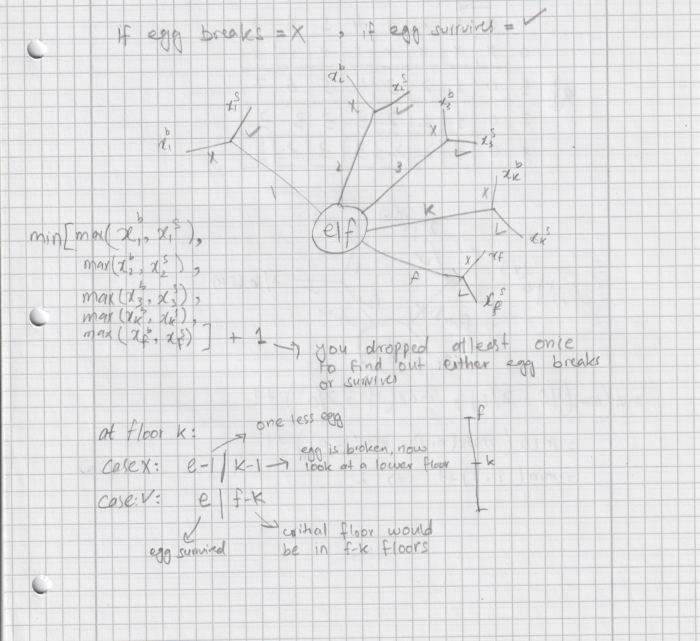

# Algorithms Princeton University

Algorithms course from Princeton University on Coursera

## Programming Assignment: Percolation

Write a program to estimate the value of the percolation threshold via Monte Carlo simulation.

[Link to the Assignment Specification](https://coursera.cs.princeton.edu/algs4/assignments/percolation/specification.php)

## Analysis of Algorithms

### 1. 3-SUM in quadratic time

Design an algorithm for the 3-SUM problem that takes time proportional to $n^2$ in the worst case. You may assume that 
you can sort the $n$ integers in time proportional to $n^2$ or better.

#### Hint:

Given an integer $x$ and a sorted array $a[]$ of $n$ distinct integers, design a linear-time algorithm to 
determine if there exists two distinct indices $i$ and $j$ such that $a[i] + a[j] == x$.

### 2. Search in a bitonic array

An array is bitonic if it comprises an increasing sequence of integers followed immediately by a decreasing sequence of 
integers. Write a program that, given a bitonic array of $n$ distinct integer values, determines whether a given 
integer is in the array.
 - Standard version: Use $\sim 3 log{} {n}$
 - Signing bonus: Use $\sim 2 log{} {n}$ compares in the worst case (and prove that no algorithm can guarantee to perform 
  fewer than $\sim 2 log{} {n}$ compares in the worst case).

#### Hint:
Standard version: First, find the maximum integer using $\sim 1$ $log{}{n}$ compares—this divides the 
array into the increasing and decreasing pieces.

Signing bonus: Do it without finding the maximum integer.

### 3. Egg drop

Suppose that you have an $n-story$ building (with floors $1$ through $n$) and plenty of eggs. An egg breaks if it is 
dropped from floor $T$ or higher and does not break otherwise. Your goal is to devise a strategy to determine the value 
of $T$ given the following limitations on the number of eggs and tosses:
 - Version 0: 1 egg, $\leq T$ tosses.
 - Version 1: $\sim 1$ $log{}{T}$ eggs and $\sim 1$ $log{}{n}$ tosses.
 - Version 2: $\sim log{}{T}$ eggs and $\sim 2 log{}{T}$ tosses.
 - Version 3: $2$ eggs and $\sim 2 \sqrt{n}$ tosses.
 - Version 4: $2$ eggs and $\leq c\sqrt{T}$ tosses for some fixed constant $c$.

#### Hint:
- Version 0: sequential search.
- Version 1: binary search.
- Version 2: find an interval containing $T$ of size $\leq 2T$, then do binary search.
- Version 3: find an interval of size $\sqrt{n}$, then do sequential search. Note: can be improved to $\sim \sqrt{2n}$
  tosses.
- Version 4: $1 + 2 + 3 + … + t$ $\sim$ $\frac{1}{2}t^2$. Aim for $c = 2\sqrt{2}$.

